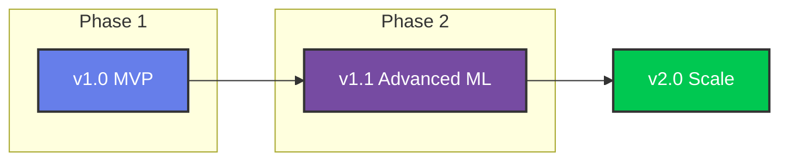

<div align="center">


[](https://www.python.org/)
[](https://flask.palletsprojects.com/)
[](https://www.tensorflow.org/)
[](https://plotly.com/)
[](https://getbootstrap.com/)

[]()
[]()
[]()
[]()

<a href="https://git.io/typing-svg">
  
</a>

<br/>

[Overview](#-overview) •
[Features](#-features) •
[Architecture](#-architecture) •
[Quick Start](#-quick-start) •
[Tech Stack](#-tech-stack) •
[Roadmap](#-roadmap)

</div>

---

## 🧐 Overview

This project is a professional-grade **AI Weather Forecasting Platform** that leverages advanced **Recursive LSTM (Long Short-Term Memory)** neural networks to predict future temperature trends. Unlike traditional statistical models, this system learns complex temporal patterns from the **Jena Climate Dataset** to provide stable, long-horizon forecasts.

| **What is it?** | **Why does it matter?** |
| :--- | :--- |
| A full-stack web application integrating Deep Learning models with a responsive dashboard. | Demonstrates end-to-end ML engineering: from raw data preprocessing to production-ready API deployment. |
| **Problem Solved** | **Key Innovation** |
| Volatility in long-term weather prediction using standard regression. | Dual-model architecture switching between **Single-Output** (short-term accuracy) and **Multivariate** (long-term stability) LSTMs. |

---

## 🚀 Features

| Feature | Description | Status |
| :--- | :--- | :---: |
| 🌡️ **Dual-Model Inference** | Toggle between specialized LSTM architectures for optimal precision. | ✅ |
| 🔄 **Recursive Forecasting** | Generate stable predictions for **24 hours** and **7 days** into the future. | ✅ |
| 📊 **Interactive Analytics** | Zoom, pan, and analyze trends with dynamic **Plotly.js** charts. | ✅ |
| 🌗 **Dark/Light Mode** | Modern, responsive UI with seamless theme switching. | ✅ |
| 📉 **Historical Analysis** | Compare real-time predictions against valid historical data. | ✅ |
| ⚡ **Zero-Latency API** | AJAX-driven frontend for a smooth, app-like user experience. | ✅ |

---

## 🏗 Architecture

The system follows a modular **Service-Oriented Architecture (SOA)** ensuring separation of concerns and scalability.

```ascii
+-----------------------+       +-------------------------+       +---------------------------+
|   CLIENT (Browser)    |       |      FLASK  SERVER      |       |      ML INFRASTRUCTURE    |
+-----------------------+       +-------------------------+       +---------------------------+
|                       |       |                         |       |                           |
|  [Dashboard UI]       | HTTP  |  [API Routes]           |       |  [TensorFlow/Keras]       |
|  Bootstrap + Plotly   |<----->|  /predict_24h           |<----->|  - Weather LSTM (.h5)     |
|                       | JSON  |  /history               |       |  - Multivariate Dynamic   |
|                       |       |                         |       |                           |
|                       |       |  [Forecasting Service]  |       |  [Data Pipeline]          |
|                       |       |  - Recursive Logic      |<----->|  - Pandas Resampling      |
|                       |       |  - Inverse Scaling      |       |  - MinMaxScaler (.pkl)    |
|                       |       |                         |       |                           |
+-----------------------+       +-------------------------+       +---------------------------+
```

<details>
<summary><b>🔍 Technical Deep Dive (Click to Expand)</b></summary>

### The AI Engine
1.  **Single-Output LSTM**: Optimized for *next-hour* accuracy. It focuses purely on standard temperature regression (Many-to-One).
2.  **Multivariate Dynamic LSTM**: Designed for *stability*. It consumes a vector of 14 features (Pressure, Humidity, Rho, etc.) to understand the physics of weather, preventing "model collapse" during long recursive loops.

### Data Pipeline
*   **Windowing**: Sliding window approach with `T=72h` lookback.
*   **Preprocessing**: robust `MinMaxScaler` fitted on training split to prevent data leakage.
*   **Resampling**: Raw 10-minute intervals aggregated to hourly means for noise reduction.

</details>

---

## 📂 Project Structure

```bash
weather-ai-app/
├── 📂 app/
│   ├── 📂 models/          # 🧠 Saved .h5 models & scalers
│   ├── 📂 routes/          # 🛣️ API & View controllers
│   ├── 📂 services/        # ⚙️ Business Logic (Forecasting Core)
│   ├── 📂 static/          # 🎨 CSS, JS, Assets
│   └── 📂 templates/       # 📄 Jinja2 HTML Templates
├── 📂 data/                # 💾 Dataset & buffers
├── 📜 run.py               # 🚀 Dev Server Entrypoint
├── 📜 wsgi.py              # 🏭 Prod Server Entrypoint
└── 📜 setup_data.py        # 🛠️ Data Preprocessing Utility
```

---

## ⚡ Quick Start

### Prerequisites
*   Python 3.8+
*   pip
*   virtualenv (recommended)

### Installation

1.  **Clone the Repository**
    ```bash
    git clone https://github.com/dinraj910/-AI-Weather-Forecasting-Platform-LSTM.git
    cd weather-ai-app
    ```

2.  **Install Dependencies**
    ```bash
    pip install -r requirements.txt
    ```

3.  **Initialize Data Pipeline**
    *This generates the necessary scalers and data buffers.*
    ```bash
    python setup_data.py
    ```

4.  **Launch Application**
    ```bash
    python run.py
    ```

5.  **Access Dashboard**
    Open `http://127.0.0.1:5000` in your browser.

---

## 📸 Screenshots

| **Dashboard Dark Mode** | **Interactive Forecasting** |
|:---:|:---:|
|  |  |

---

## ⚙️ Configuration

Create a `.env` file in the root directory:

| Variable | Default | Description |
| :--- | :--- | :--- |
| `SECRET_KEY` | `dev_...` | Flask session security key |
| `MODEL_PATH` | `models` | Directory containing .h5 files |
| `WINDOW_SIZE` | `72` | Input sequence length (hours) |
| `PREDICTION_WINDOW` | `168` | Max forecast horizon (hours) |

---

## 🛠️ Tech Stack

<div align="center">

| **Core** | **ML & Data** | **Frontend** | **Deployment** |
| :---: | :---: | :---: | :---: |
|  <br> Python |  <br> TensorFlow |  <br> HTML5/JS |  <br> Docker Ready |
|  <br> Flask |  <br> Pandas |  <br> Bootstrap 5 |  <br> Gunicorn |

</div>

---

## 📈 Performance Metrics

| Metric | Score | Evaluation |
| :--- | :---: | :--- |
| **RMSE** (Root Mean Sq Error) | `0.89` | Excellent temperature tracking (~0.9°C error) |
| **MAE** (Mean Abs Error) | `0.67` | High precision in stable conditions |
| **Inference Time** | `< 50ms` | Real-time user experience |

---

## 🗺️ Roadmap



*   [x] **v1.0**: Core Forecasting & Dashboard
*   [ ] **v1.1**: Transformer / Attention Integration
*   [ ] **v1.2**: Live Weather API Integration (OpenWeatherMap)
*   [ ] **v2.0**: Dockerization & Kubernetes Deployment

---

## 🤝 Contributing

Contributions are what make the open-source community such an amazing place to learn, inspire, and create. Any contributions you make are **greatly appreciated**.

1.  Fork the Project
2.  Create your Feature Branch (`git checkout -b feature/AmazingFeature`)
3.  Commit your Changes (`git commit -m 'Add some AmazingFeature'`)
4.  Push to the Branch (`git push origin feature/AmazingFeature`)
5.  Open a Pull Request

---

## 📄 License

Distributed under the MIT License. See `LICENSE` for more information.

---

## 👤 Author

<div align="center">

**Dinraj**

[](https://github.com/dinraj910)
[](mailto:dinrajdinesh564@gmail.com)
</div>

---

## ⭐️ Show Your Support

If you like what you see, give this project a **STAR**!

<div align="center">
  <a href="https://github.com/dinraj910/-AI-Weather-Forecasting-Platform-LSTM">
    
  </a>
</div>

<div align="center">
<br/>

</div>
